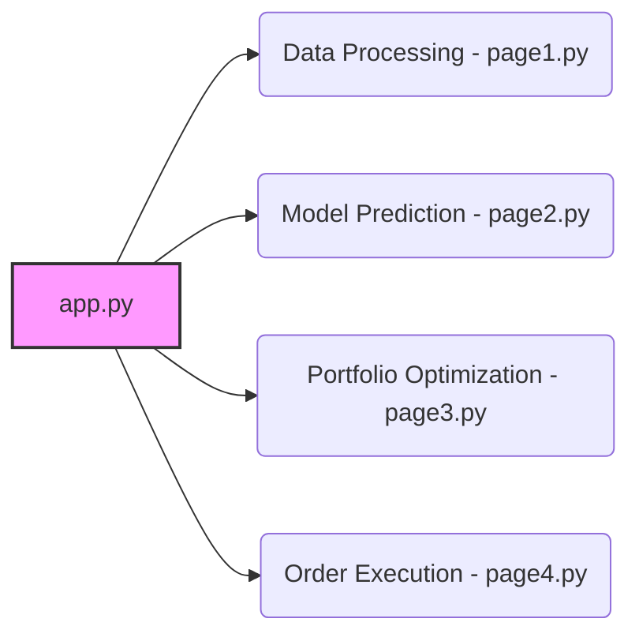

id: 68f8e0bddaf6d5ab675ad837_documentation
summary: From Deep Learning to LLMs: A survey of AI in Quantitative Investment Documentation
feedback link: https://docs.google.com/forms/d/e/1FAIpQLSfWkOK-in_bMMoHSZfcIvAeO58PAH9wrDqcxnJABHaxiDqhSA/viewform?usp=sf_link
environments: Web
status: Published
# QuLab: Alpha Strategy Pipeline Simulator Codelab

This codelab will guide you through the QuLab application, a Streamlit-based tool designed to simulate a simplified alpha strategy pipeline. You'll gain a comprehensive understanding of each stage, from data processing to order execution, and how they contribute to quantitative investment strategies. This application aims to provide hands-on experience and insights into the complexities of building and deploying algorithmic trading systems.

## Introduction and Setup
Duration: 00:05

This application is designed to simulate a quantitative investment strategy, allowing users to explore the different stages involved in building and deploying an algorithmic trading system. The application provides a hands-on experience in data processing, model prediction, portfolio optimization, and order execution.

Key benefits of understanding this pipeline:

*   **Systematic Approach**: Learn how to structure a quantitative investment strategy from start to finish.
*   **Data-Driven Decisions**: Understand how data is transformed into actionable insights.
*   **Risk Management**: Explore how portfolio optimization helps manage risk.
*   **Performance Evaluation**: Gain insights into how order execution impacts overall strategy performance.

To get started:

1.  Clone the repository containing the Streamlit application.
2.  Install the required Python packages using `pip install streamlit numpy pandas matplotlib seaborn plotly`.
3.  Run the application using `streamlit run app.py`.

## Understanding the Application Architecture
Duration: 00:10

The application follows a modular design, with each stage of the alpha strategy pipeline represented as a separate page. The main `app.py` file serves as the entry point, handling navigation and routing to individual page modules.

Here's a breakdown of the file structure:

*   `app.py`: Main application file containing the UI setup, navigation, and routing logic.
*   `application_pages/`: Directory containing the individual page modules.
    *   `page1.py`: Data Processing page.
    *   `page2.py`: Model Prediction page.
    *   `page3.py`: Portfolio Optimization page.
    *   `page4.py`: Order Execution page.

The following diagram illustrates the application architecture:



`app.py` uses `streamlit.selectbox` to create a navigation menu in the sidebar.  Based on the user's selection, it imports and runs the corresponding page module.  Each page module then uses Streamlit's UI elements to display information and allow user interaction.

## Data Processing: Cleaning and Preparing Data (page1.py)
Duration: 00:20

The Data Processing stage is crucial for preparing raw financial data for subsequent analysis and modeling. This page focuses on generating synthetic financial data and performing basic validation.

1.  **Synthetic Data Generation**:

    The `generate_synthetic_financial_data` function creates a DataFrame containing synthetic OHLC (Open, High, Low, Close) data, Volume, and Sentiment Score for multiple assets over a specified period.

    ```python
    def generate_synthetic_financial_data(num_assets, num_days, start_date, seed=None):
        """Generate synthetic OHLC data for multiple assets over business days."""
        # ... (implementation details) ...
    ```

    *   `num_assets`: The number of assets to simulate.
    *   `num_days`: The number of business days to simulate.
    *   `start_date`: The starting date for the data in "YYYY-MM-DD" format.
    *   `seed`: Random seed for reproducibility.

    The function generates data based on a stochastic process, simulating realistic price movements.  It includes random variations in drift and volatility for each asset, ensuring diverse price behaviors.  Synthetic volume and sentiment scores are also generated to enrich the dataset.

2.  **Data Validation**:

    The `validate_and_summarize_data` function checks the DataFrame for structural integrity, including missing columns and duplicate entries.  It also performs simple mean imputation for missing values.

    ```python
    def validate_and_summarize_data(df):
        """Validate structure, detect duplicates, impute simple means, and return cleaned DataFrame."""
        # ... (implementation details) ...
    ```

    This function is critical for ensuring data quality and preventing errors in downstream processes. It raises `ValueError` exceptions for critical issues like empty DataFrames or missing columns.  Duplicate rows are identified and removed.  Missing values in numerical columns are filled with the mean of the respective column.

3.  **User Interface**:

    The Streamlit UI allows users to specify the parameters for data generation, such as the number of assets, the number of days, and the start date. It then displays the generated data in a table and provides visualizations to explore the data's characteristics.

    The UI leverages Streamlit widgets like `st.number_input` and `st.date_input` to collect user input.  Generated data is displayed using `st.dataframe`, and visualizations are created using `plotly.express` to show price trends and distributions.

    Here's a snippet of how the data is visualized using `plotly.express`:

    ```python
    fig = px.line(df, x="Date", y="Close", color='Asset_ID', title='Simulated Asset Prices')
    st.plotly_chart(fig, use_container_width=True)
    ```

## Model Prediction: Forecasting Asset Performance (page2.py)
Duration: 00:10

This page focuses on the Model Prediction stage, where machine learning models are used to forecast future asset performance based on processed data. Currently, this page serves as a placeholder for future implementation.

1.  **Future Implementation**:

    The current implementation of this page only displays a header and a markdown text explaining the purpose of this stage.

    ```python
    import streamlit as st

    def run_page2():
        st.header("2. Model Prediction")
        st.markdown("""
        This page is dedicated to **Model Prediction**, a crucial stage in the alpha strategy pipeline.
        In this phase, we would typically use machine learning models to forecast future asset performance, such as returns or price movements, based on the processed data.

        ### Business Value
        Accurate model predictions are the foundation for generating $\alpha$. By leveraging sophisticated algorithms, we aim to identify patterns and signals that are not easily discernible through traditional analysis, thereby gaining an edge in the market.

        ### Future Implementation
        This section will be expanded to include:
        -   Feature engineering based on the validated data.
        -   Selection and training of predictive models (e.g., Ridge Regression, Deep Learning models).
        -   Visualization of model predictions and performance metrics.
        -   Interactive components to adjust model parameters.
        """)
    ```

2.  **Intended Functionality**:

    The goal of this page is to allow users to select and train machine learning models (e.g., Ridge Regression, Deep Learning models) to predict future asset returns. The page should also provide visualizations of model predictions and performance metrics.

## Portfolio Optimization: Allocating Capital Efficiently (page3.py)
Duration: 00:10

This page focuses on Portfolio Optimization, where the goal is to determine the optimal allocation of capital across various assets to maximize expected returns for a given level of risk. Currently, this page serves as a placeholder for future implementation.

1.  **Future Implementation**:

    The current implementation of this page only displays a header and a markdown text explaining the purpose of this stage.

    ```python
    import streamlit as st

    def run_page3():
        st.header("3. Portfolio Optimization")
        st.markdown("""
        This page focuses on **Portfolio Optimization**, where we determine the optimal allocation of capital across various assets.
        Using predicted asset returns and risk metrics, we construct a portfolio that maximizes expected returns for a given level of risk, or minimizes risk for a target return.

        ### Business Value
        Effective portfolio optimization is essential for managing risk and maximizing returns. It ensures that capital is allocated efficiently, aligning the investment strategy with risk tolerance and financial objectives. This involves balancing assets to achieve desired portfolio characteristics, such as specific `Value at Risk (VaR)` or `Conditional Value at Risk (CVaR)` levels.

        ### Future Implementation
        This section will be expanded to include:
        -   Mean-Variance Optimization (Markowitz model).
        -   Constraints for portfolio weights.
        -   Visualization of efficient frontiers.
        -   Interactive elements to adjust risk aversion parameters.
        """)
    ```

2.  **Intended Functionality**:

    The goal of this page is to allow users to perform mean-variance optimization (Markowitz model), set constraints for portfolio weights, visualize efficient frontiers, and adjust risk aversion parameters.

## Order Execution: Implementing the Trading Strategy (page4.py)
Duration: 00:10

This page focuses on Order Execution, the final step in translating investment decisions into actual market trades. The goal is to implement the optimized portfolio allocation by strategically placing and managing trades to minimize market impact costs. Currently, this page serves as a placeholder for future implementation.

1.  **Future Implementation**:

    The current implementation of this page only displays a header and a markdown text explaining the purpose of this stage.

    ```python
    import streamlit as st

    def run_page4():
        st.header("4. Order Execution")
        st.markdown("""
        This page addresses **Order Execution**, the final step in translating investment decisions into actual market trades.
        The goal is to implement the optimized portfolio allocation by strategically placing and managing trades to minimize market impact costs and ensure timely execution.

        ### Business Value
        Efficient order execution is critical for preserving the $\alpha$ generated by the strategy. Poor execution can erode potential profits through high transaction costs, slippage, and adverse market impact. Optimizing this stage ensures that the theoretical returns from prediction and optimization are realized in practice.

        ### Future Implementation
        This section will be expanded to include:
        -   Simulation of trade orders based on portfolio changes.
        -   Consideration of transaction costs and market impact.
        -   Visualization of executed trades and their costs.
        -   Interactive components to simulate different execution algorithms.
        """)
    ```

2.  **Intended Functionality**:

    The goal of this page is to allow users to simulate trade orders based on portfolio changes, consider transaction costs and market impact, visualize executed trades and their costs, and simulate different execution algorithms.

## Conclusion
Duration: 00:05

This codelab has provided a comprehensive overview of the QuLab application and its functionalities. You've learned about the different stages of the alpha strategy pipeline, from data processing to order execution, and how they contribute to quantitative investment strategies. While some sections are currently placeholders for future implementation, you now have a solid foundation for understanding and potentially contributing to the development of this application.
